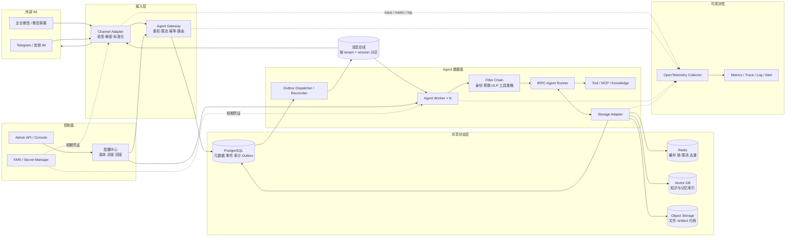
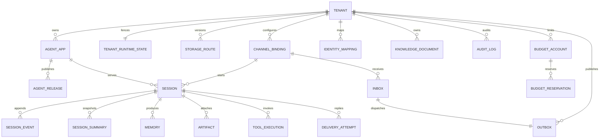

# tRPC-Agent 多租户节点化部署平台：架构设计

> 状态：v1.2（implementation-backed; live-environment validation pending）
> 目标读者：平台研发、SRE、安全、Agent 应用开发者
> 范围：控制面、数据面、IM 接入、状态与一致性、治理、可观测性及运维；不包含具体模型提示词设计。

## 1. 目标与设计原则

平台允许多个租户独立创建 Agent 应用，绑定企业微信、微信公众号或 Telegram 等入口，并为每个应用选择模型、知识库、工具权限和数据后端。Agent Worker 可水平扩展，任一健康 Worker 都能继续某个会话，节点故障不能导致已确认消息或会话状态丢失。

建议首期 SLO：Webhook 接收可用性 99.95%，已经完成 Inbox/Outbox 接收事务的消息不丢失，重复业务回复率低于 0.01%，同步回调在 IM 平台时限内完成验签和持久接收，普通文本消息端到端 P95 小于 8 秒（不含明确的长任务），租户配置 RPO 为 0、RTO 小于 15 分钟。模型及外部工具属于依赖项，单独统计其 SLI。

核心原则如下：

1. **先确定租户，再接触业务数据**：由可信的 `channel_binding` 解析 `tenant_id`，不接受请求体自行声明租户。
2. **Worker 无状态**：不依赖 sticky session；Session、Memory、锁和幂等记录均在共享后端。
3. **一会话顺序执行，跨会话并行**：消息总线以 `tenant_id + session_id` 分区，数据库版本号作为最终并发防线。
4. **事实与索引分离**：SQL 保存事实和审计，Redis 保存短期状态，向量库保存可重建索引，对象存储保存大对象。
5. **默认拒绝**：工具、模型、知识库、IM 用户权限和预算均由租户策略显式放行。
6. **至少一次传输、分级效果保证**：平台内部通过唯一键、事务、Outbox 和 fencing 实现幂等提交；外部 Tool/IM 只有在 provider 支持幂等键时才能承诺 exactly-once effect，否则明确暴露 `unknown` 并进入查询、对账或人工处置，绝不把“重试”描述成 exactly-once。

## 2. 总体架构



### 2.1 组件职责

| 组件 | 职责 | 扩缩容与状态 |
|---|---|---|
| Channel Adapter | IM 验签、解密、协议转换、快速 ACK；将标准回复转成文本、流式更新、卡片或媒体 | 按通道独立部署，无业务状态 |
| Agent Gateway | 绑定解析、身份映射、租户限流、生成 trace；在一个 SQL 事务内写 Inbox 与 inbound-dispatch Outbox，事务提交后才 ACK | 无状态，多副本 |
| Agent Worker | 持久认领输入与 fenced Session，加载版本化配置，执行 Filter、Runner、Tool，提交事件和回复 | 无状态，按队列深度扩缩容 |
| Storage Adapter | 为 Session、Memory、Knowledge、Artifact、Audit 暴露统一接口，隐藏具体后端 | 可随 Worker 内嵌；连接池按后端隔离 |
| Admin API | 租户、应用、通道、后端、策略及发布管理；写操作审计 | 控制面独立扩容 |
| Telemetry Collector | 汇聚 trace、metric、结构化日志并导出到观测后端 | 多副本，支持本地缓冲 |
| Dispatcher / Reconciler | 用 `FOR UPDATE SKIP LOCKED` 恢复并发布 inbound/reply Outbox；执行 Memory 投影、文件处理、迁移校验和失败补偿 | 幂等消费者，可水平扩容；MQ 可能收到重复消息 |

### 2.2 控制面与数据面

控制面保存配置草稿和不可变的行为版本。发布时生成 `config_version`，包含模型参数、提示词、一般工具 allowlist、Filter 和知识库版本；Worker 只读取已发布快照并在本地做短 TTL 缓存。一次执行不切换行为版本。

行为版本之外还有**实时安全信封**：租户启停、平台/租户工具 denylist、`security_epoch`、credential revocation epoch、预算硬开关和 emergency kill switch。它不随 Session 固定，接收输入、取得执行权、每次模型/Tool 调用前以及最终提交前都必须读取当前值。安全变更递增 `security_epoch`、撤销旧 lease 并推送缓存失效；无法确认实时安全状态时，外部副作用默认 fail closed。控制面普通配置读取失败时可以使用最近已验证快照，但安全信封不能用无限期陈旧缓存。

## 3. 租户、应用与隔离

租户模型至少包含：

```json
{
  "tenant_id": "t_acme",
  "status": "active",
  "app_config": {"default_agent_id": "agt_support", "locale": "zh-CN"},
  "model_config": {"provider_ref": "secret://t_acme/llm", "model": "approved-model", "max_tokens": 4096},
  "tool_policy": {"allow": ["ticket.read", "ticket.create"], "confirm": ["refund.execute"]},
  "channel_config": {"bindings": ["cb_wecom_support"]},
  "storage_profile": {"session": "postgres-main", "cache": "redis-a", "knowledge": "vector-a"},
  "audit_policy": {"retention_days": 365, "content_mode": "redacted"},
  "budget": {"monthly_usd": 1000, "per_request_tokens": 12000},
  "config_version": 17,
  "routing_epoch": 4,
  "security_epoch": 23,
  "live_security": {"execution_enabled": true, "tool_deny": [], "credential_revocation_epoch": 8}
}
```

隔离不是只增加 `tenant_id`：

- **配置**：配置表联合主键包含 `tenant_id`；发布快照签名；缓存键固定以租户前缀开头。Admin API 的 RBAC 同时校验组织、租户和资源。
- **数据**：所有仓储方法强制接收 `TenantContext`。共享 PostgreSQL 使用 `ENABLE/FORCE ROW LEVEL SECURITY`；可执行策略见 [`rls.sql`](./rls.sql)，越权回归见 [`rls-regression.sql`](./rls-regression.sql)。高合规租户可路由至独立 schema、实例、Redis Cluster 和对象存储桶。备份与导出也按租户授权。
- **工具**：先取平台级 allowlist 与租户级 allowlist 的交集，再校验用户角色和参数规则；MCP 凭证按租户注入，禁止 Worker 使用全局高权限凭证。
- **知识**：向量条目带不可省略的 `tenant_id / knowledge_base_id / acl` 过滤条件；查询无租户过滤时 Adapter 直接报错。
- **密钥**：数据库仅保存 secret 引用。KMS/Secret Manager 按 Worker 身份和租户路径授权，凭证短期缓存且不进入环境转储。
- **日志**：入口先对 token、手机号、邮箱、证件号和自定义敏感字段脱敏；prompt/response 默认不进入 trace，只记录哈希、长度和分类。审计正文加密并独立授权。
- **资源与成本**：Redis 令牌桶只负责流量整形；硬预算通过 SQL `budget_account + budget_reservation` 原子预留和结算，不能退化为各副本本地额度。指标只带受控的 `tenant_bucket`，避免高基数 user/session 标签。

应用流量使用 `NOSUPERUSER NOBYPASSRLS` 的 NOLOGIN 组角色，表 owner 和迁移角色均为 NOLOGIN，实际登录凭证由工作负载身份提供且不得拥有 owner/bypass 权限。每个事务执行 `SET LOCAL app.tenant_id`，提交或回滚后自动清除；连接归还池前必须回滚未结束事务并断言 tenant GUC 已清空，checkout 时再次 fail-closed 检查。禁止 session 级 `SET app.tenant_id`，后台批任务也按单租户事务循环，不以 bypass role 扫描业务表。

## 4. 消息路由、Session 与完整链路

### 4.1 标准消息信封

Channel Adapter 将平台差异收敛为 `InboundEnvelope`：

```json
{
  "event_id": "evt_01J...",
  "idempotency_key": "wecom:corp_1:msg_9381",
  "tenant_id": "t_acme",
  "agent_id": "agt_support",
  "channel": "wecom",
  "channel_account_id": "corp_1/app_7",
  "conversation": {"type": "group", "external_id": "room_42", "thread_id": null},
  "principal": {"external_user_id": "zhangsan", "subject_id": "usr_19"},
  "message": {"type": "text", "text": "查询订单 123", "attachments": []},
  "occurred_at": "2026-09-09T08:00:00Z",
  "traceparent": "00-...-...-01"
}
```

`tenant_id` 由请求到达的绑定 ID、企业 ID/机器人 ID和已验签账号三者联合查询获得。由于第一次查询尚无 RLS tenant context，Gateway 只能把不可枚举 webhook key 哈希传给 `SECURITY DEFINER app_security.resolve_binding()`；该函数对无直接授权的最小 locator 做 exact-match，只返回 `tenant_id + binding_id`。Gateway 随即开启事务并 `SET LOCAL app.tenant_id`，再通过 RLS 读取 secret 引用、验签并核对企业/机器人 ID。它没有跨租户 `channel_binding` 查询权，locator 也不包含 secret 或用户数据。外部用户经 `identity_mapping` 映射成租户内 `subject_id`；同一个自然人在不同租户中得到不同主体，禁止跨租户合并画像。

Session ID 使用不可逆、稳定规则：

- 单聊：`sha256(tenant_id | agent_id | channel | account_id | "dm" | subject_id)`；同一租户是否允许跨通道会话合并由显式 identity-link 策略控制，默认不合并。
- 群聊：`sha256(tenant_id | agent_id | channel | account_id | "group" | conversation_id | thread_id?)`；发送者保存在 event 中而不是 session 主键中。
- 若应用要求“一人一群一上下文”，再将 `subject_id` 加入群聊规则；规则版本写入 Session，后续变更通过新建 Session 完成。

### 4.2 不使用 sticky session

消息总线以 `tenant_id + session_id` 为 partition key，在正常情况下保证同一 Session 顺序消费，但正确性不依赖 MQ 顺序或 sticky session。Worker 在执行模型前，用一个 SQL 事务认领 Inbox 并取得 Session lease：仅当 Inbox 尚未提交且 Session 无有效 owner 时，写入稳定的 `execution_id`、`active_inbox_id`、`lease_owner`、`lease_expires_at`，并递增单调 `lease_fence`。Worker 周期性续租；Redis lease 只能减少 SQL 竞争。

模型/Tool 前检查 `lease_fence + routing_epoch + security_epoch`，Tool ID 由 `sha256(inbox_id | execution_id | tool_step)` 确定。最终提交条件同时包含 `version=expected_version AND lease_fence=claimed_fence AND active_inbox_id=inbox_id`，成功后清除 owner。失去 lease 的旧 Worker 即使恢复也不能提交状态或创建新的 Tool intent。租约在模型请求飞行中到期仍可能产生重复模型费用；如果模型 provider 不支持请求幂等，这一成本无法严格消除，平台对其计量和告警，但依靠 fence 防止它进入 Session 或触发后续副作用。

### 4.3 核心时序

```mermaid
sequenceDiagram
    autonumber
    actor U as 企业微信用户
    participant C as WeCom Adapter
    participant G as Agent Gateway
    participant DB as PostgreSQL
    participant D as Outbox Dispatcher
    participant Q as Message Bus
    participant W as Agent Worker
    participant F as Filter Chain
    participant R as tRPC-Agent Runner
    participant T as Tool / MCP
    participant M as Session / Memory Adapter

    U->>C: 发送消息 (MsgId)
    C->>DB: resolve_binding(hash, provider)
    DB-->>C: tenant_id + binding_id（无 secret）
    C->>DB: TX: SET LOCAL tenant; load binding/secret ref
    DB-->>C: binding metadata; COMMIT
    C->>C: 验签、解密、核对账号、标准化
    C->>G: InboundEnvelope + traceparent
    G->>DB: BEGIN; INSERT inbox + inbound.dispatch outbox
    alt 首次接收
      DB-->>G: COMMIT accepted
    else 重复投递
      DB-->>G: ROLLBACK unique conflict; 查询已有状态
    end
    G-->>C: 仅在 durable transaction 已存在后 ACK
    C-->>U: 平台要求的确认响应
    D->>DB: claim pending outbox (SKIP LOCKED)
    D->>Q: publish(partition=tenant+session)
    D->>DB: 标记 published（崩溃可导致 MQ 重复，不会丢 Inbox）
    Q->>W: envelope + trace context
    W->>DB: TX claim inbox + fenced session + reserve budget
    DB-->>W: execution_id, version=N, lease_fence=F, epochs
    W->>M: 读取 session/version/summary/memory
    M-->>W: ContextSnapshot(version=N)
    W->>F: 实时安全信封、身份、预算、DLP、工具权限
    F-->>W: allow / redact / confirm / deny
    W->>R: run(input, context, config_version)
    R->>DB: INSERT deterministic tool intent (prepared)
    R->>T: tool.call(args, provider idempotency key)
    T-->>R: tool result
    R->>DB: succeeded / failed / unknown
    R-->>W: Agent Events + reply
    W->>M: TX 校验 fence/epochs，追加 event，CAS state，写 reply outbox
    M-->>W: committed(version=N+1)
    D->>DB: claim reply outbox
    D->>Q: ReplyEnvelope (同一 trace_id)
    Q->>C: 待投递回复
    C->>DB: INSERT delivery_attempt(sending)
    C->>U: 文本 / 卡片 / 媒体回复
    C->>DB: accepted / failed / unknown
    Note over C,M: trace_id 串联 callback、queue、Runner、Tool、存储和回复 span
```

Inbound ACK 的耐久性边界是 **Inbox 与 `inbound.dispatch` Outbox 的同一个 SQL commit**，不是 MQ publish。Dispatcher 在 publish 后、标记 Outbox 前崩溃只会造成 MQ 重复；Worker 通过 Inbox claim 抑制重复执行。若接收事务失败，Gateway 返回平台可重试响应，不能 ACK。

回复只有在 Session 事务提交后才进入 reply Outbox，因此 Worker 崩溃不会丢已提交回复。然而外部 IM 接受请求后、Adapter 记录 `accepted` 前仍存在不可消除的 crash gap：支持 provider idempotency key 时安全重试；支持消息查询时先对账；两者都不支持时标记 `unknown`、停止自动重发并交由租户策略决定人工补发或容忍潜在重复。

## 5. 数据模型

完整 PostgreSQL DDL 见 [`schema.sql`](./schema.sql)。核心关系如下：



关键约束：

- 每个业务表以 `(tenant_id, id)` 为主键或唯一键，外键同时包含 `tenant_id`，从结构上阻止跨租户关联；`agent_release` 保存不可变配置，`agent_app.active_config_version` 只移动发布指针。
- `session_event` 以 `(tenant_id, session_id, seq)` 唯一；原始 IM 消息以 `(tenant_id, channel_binding_id, external_message_id)` 唯一。
- `session.version` 与 `lease_fence` 共同保护提交，`active_inbox_id` 表示当前输入；`session.last_event_seq` 指向已提交事件，`session_summary.based_on_seq` 表示摘要覆盖范围。
- `tenant_runtime_state` 独立保存实时 `routing_epoch / security_epoch / execution_mode`；行为版本回滚不会回滚安全吊销或存储 fencing。
- Memory intent 的 SQL 记录是唯一事实源，向量库和外部 Memory 服务只保存投影；删除或权限变更可由 Outbox 重放。
- `budget_reservation`、`tool_execution`、`delivery_attempt` 显式表示处理中和 `unknown`，不能用缺少成功记录推导外部调用失败。
- Audit Log 仅追加，不允许业务角色更新；按月分区并将过期分区归档到启用保留策略的对象存储。

审计字段至少包括：`occurred_at, tenant_id, channel, subject_id, session_id, agent_name, tool_name, decision, policy_version, latency_ms, error_type, input_hash, output_hash, token_in, token_out, cost_micros, trace_id, request_id`。敏感正文不直接写入审计表，仅在策略允许时保存加密对象引用。

## 6. 统一存储抽象与多后端

Worker 只依赖语义接口，不直接依赖 Redis/SQL SDK：

```python
class SessionStore(Protocol):
    async def load(self, ctx: TenantContext, session_id: str) -> ContextSnapshot: ...
    async def commit(
        self,
        ctx: TenantContext,
        session_id: str,
        claim: ExecutionClaim,
        expected_version: int,
        events: list[Event],
        new_state: dict,
        outbox: list[OutboxItem],
    ) -> CommitResult: ...


class MemoryStore(Protocol):
    async def put(self, ctx: TenantContext, memory: Memory) -> str: ...
    async def search(self, ctx: TenantContext, query: str, acl: ACL) -> list[Memory]: ...


class ArtifactStore(Protocol):
    async def create_upload(self, ctx: TenantContext, metadata: dict) -> SignedUpload: ...
    async def open(self, ctx: TenantContext, artifact_id: str) -> AsyncIterator[bytes]: ...
```

`StorageProfileResolver` 根据 `tenant_id + routing_epoch + data_kind` 选出 Adapter，禁止调用方传入任意后端地址。`config_version` 决定行为，不决定当前写者。Adapter 必须实现租户键注入、超时、重试、熔断、指标和 trace；能力矩阵声明是否支持事务、CAS、TTL、向量过滤和 read-your-write，不满足 Session 所需强一致能力的后端不得被配置为事实源。

| 数据类型 | 推荐事实源 | 辅助后端 | 一致性与理由 |
|---|---|---|---|
| Tenant / Agent / Channel 配置 | PostgreSQL | Redis 配置缓存 | 发布与回滚强一致；缓存按版本失效 |
| Session event / state | PostgreSQL | Redis 热上下文、lease | 同 Session 强一致，跨 Session 无需全局顺序 |
| Summary | PostgreSQL | Redis 热缓存 | 异步生成但以 `based_on_seq` 防止旧摘要覆盖新摘要 |
| Memory | PostgreSQL canonical intent（正文或加密对象引用） | 外部 Memory 服务 / Vector DB 投影 | intent 与 Session 同事务；投影最终一致；当前轮做 read-your-write overlay |
| Knowledge | 对象存储原文 + SQL 元数据 | Vector DB chunk 索引 | 摄取异步、版本化发布；索引可重建 |
| Artifact | 对象存储 | SQL 元数据 | 大对象低成本持久化；校验 checksum 与租户前缀 |
| Audit Log | PostgreSQL/WORM 日志库 | 对象存储归档 | 追加写，关键操作同步落库，分析链路可最终一致 |
| 幂等、限流、短锁 | Redis + SQL inbox | — | Redis 提供低延迟；SQL 唯一约束是最终防线 |

InMemory Adapter 只用于本地开发和单元测试：进程重启即丢失，不能多节点共享，启动时若环境为 production 则拒绝加载。

### 6.1 更新顺序和并发写

每个 Inbox 先执行 claim 事务：锁定 Inbox 和 Session；确认 `status IN (received, queued, retryable)`；确认无有效 Session lease；生成或复用确定性 `execution_id`；递增 `lease_fence`；写 `active_inbox_id/owner/expiry`；捕获当前 `routing_epoch/security_epoch`；原子预留本次最大预算；提交。只有拿到 claim 的 Worker 可以调用模型。续租必须匹配 owner 和 fence，旧 owner 不能复活。

实现不能把这些检查拆成先读后写。核心条件更新形态如下，任一步影响行数不是 1 都要回滚整个 claim：

```sql
-- 同一事务已 SELECT ... FOR UPDATE 锁定 Inbox、Session 和预算账户。
UPDATE session
SET active_inbox_id = :inbox_id,
    lease_owner = :worker_id,
    lease_expires_at = :deadline,
    lease_fence = lease_fence + 1
WHERE tenant_id = :tenant_id
  AND session_id = :session_id
  AND (active_inbox_id IS NULL OR lease_expires_at < transaction_timestamp())
RETURNING version, last_event_seq, lease_fence;

UPDATE budget_account
SET reserved_units = reserved_units + :estimate,
    version = version + 1
WHERE tenant_id = :tenant_id
  AND budget_name = :budget_name
  AND period_start = :period_start
  AND spent_units + reserved_units + :estimate <= limit_units;
```

多个预算账户始终按稳定的 `budget_name` 顺序加锁以避免死锁，并在同一事务插入 reservation、execution attempt 及 Inbox captured epochs。

一次执行读取 `version=N, last_event_seq=S`，生成若干 event。最终 SQL 单事务验证 Inbox execution、未过期或仍归属的 fence、实时安全 epoch、存储 routing epoch 与 Session version，然后追加 `S+1...S+k` 的 event；更新 state、`last_event_seq` 和 `version=N+1`；写 canonical Memory intent；插入回复、Memory 投影、摘要及审计 Outbox；结算预算；将 Inbox 标为 committed 并释放 Session claim；提交。绝不先更新缓存、外部 Memory 或向量库。事务成功后删除/更新 Redis 缓存，失败时下次读取以 SQL 为准。

摘要消费者读取连续事件区间，只能执行 `UPSERT ... WHERE current.based_on_seq < incoming.based_on_seq`。Memory 无论租户选择哪种检索服务，都先在 Session 事务写 SQL canonical intent（敏感正文可为加密对象引用）并生成 `memory.project.requested` Outbox。外部 Memory/向量消费者按 `(memory_id, version)` upsert 后回写各 projection watermark。在投影完成前，本轮新 Memory 通过 SQL 最近写集合与检索结果合并，保证 read-your-write；其他节点在 SQL 提交后立即可见 canonical 元数据，在投影延迟窗口后可被语义检索。平台不再允许把无法参与 Session 事务的外部服务声明为 Memory 事实源。

### 6.2 幂等与乱序

1. Gateway 以 `provider + account_id + external_message_id` 构造幂等键；在同一个 SQL 事务插入 Inbox 和唯一的 `inbound.dispatch` Outbox。Redis `SET NX` 仅作快速路径。状态为 `RECEIVED → QUEUED → CLAIMED → COMMITTED → REPLY_PENDING → DELIVERED`，并允许 `RETRYABLE / UNKNOWN / FAILED`。重复回调只查询该记录；事务内 Outbox 永远存在，恢复扫描器会重新发布。
2. 通道缺少稳定消息 ID 时，使用账号、会话、发送者、时间窗、正文摘要生成弱幂等键，并记录碰撞指标。有 provider sequence 时按序缓冲短窗口；没有时以接收序为准。迟到消息保存原始 `occurred_at`，但不得覆写更新版本的 summary/state。
3. Tool intent 必须在调用前持久化；`tool_call_id` 从 Inbox/execution/step 确定性派生，并作为 provider idempotency key。支持幂等键时，超时或崩溃后可以用同一键查询/重试，语义为 exactly-once effect。provider 仅支持状态查询时先 reconcile 再决定；二者都不支持时，调用开始后失联一律标为 `unknown`，禁止自动重试并进入人工处置。人工确认只是授权，不改变幂等能力。
4. 无副作用、显式声明可重放的只读 Tool 可以有界重试。副作用 Tool 的能力注册必须声明 `idempotent | queryable | non_retriable`；未声明按 `non_retriable` 处理。平台保证 ledger intent 不重复，不声称所有外部效果 exactly-once。
5. Reply Outbox 与 Session commit 原子，但 delivery attempt 在调用 provider 前落库。provider 接受、确认响应丢失时记录 `unknown`；只有 provider 支持 idempotency key 才自动重试，否则先查询或人工决策。稳定的内部 `delivery_id` 本身不能消除外部重复。

Tool intent 的插入也不是裸 `INSERT`：同一事务必须锁定 Session 与 `tenant_runtime_state`，验证 `active_inbox_id / lease_fence / routing_epoch / security_epoch` 全部等于 execution claim 后才允许写入。授权或人工确认后，再次验证 fence 并把 intent 从 `prepared/confirmed` 提交为 `running`，之后才发网络请求。新 Worker 遇到已有 `running` 时不能新建调用；进程失联后，watchdog 只把它转为 `unknown/reconciling`，不会直接改成 failed 或重新调用。若模型重跑后同一 `tool_step` 产生不同 `arguments_hash`，视为执行分叉并停止处理，不能用同一 provider idempotency key 提交不同操作。

### 6.3 后端迁移

强一致事实源迁移使用 `storage_route.routing_epoch` fencing，任何时刻只允许一个 writer：

1. **盘点与回填**：保持源为唯一 writer，冻结数据模型版本，记录源高水位 `W0`，按 tenant 分片复制快照；对象和向量按 checksum/业务 ID 幂等 upsert。
2. **增量追平**：仍只有源 writer；使用有序 CDC/Outbox 将 `>W0` 变更投影到目标。影子读只比较，不向调用方返回目标结果。
3. **Drain**：将 `tenant_runtime_state.execution_mode` 设为 `draining`，停止新 Inbox claim，等待有效 execution 结束或 lease 到期并 fence；记录最终源水位 `W1`。
4. **校验**：目标必须追到 `W1`，数量、版本、hash 和约束校验通过。仍不切目标读，避免 stale read。
5. **原子切换**：一个控制面 SQL 事务把新 `storage_route` 设为唯一 writer、递增 `routing_epoch` 并恢复 `normal`。Worker 的 commit 带旧 epoch 时失败；新 claim 只解析新 route，读写同时切换。
6. **观察与回滚**：保留源只读并把目标变更有序投影回源。回滚也执行 drain、追到反向水位、校验、递增 epoch、单事务切换；禁止双写双主。过观察期再归档源。

Redis → SQL 迁移需先明确 Redis 中哪些是可丢弃缓存、哪些是事实；仅迁移事实，并使用业务版本解决 TTL 和写入时序。向量库等纯投影迁移不要求暂停 Session writer：从 SQL/对象存储原文构建新 collection，追到 projection watermark 后原子切 alias；旧索引保留到回滚窗口结束。

### 6.4 Crash-point 保证矩阵

| Crash point | 持久状态 | 恢复动作与保证 |
|---|---|---|
| Inbox/Outbox 事务提交前 | 无完整接收记录 | 不 ACK，依赖 IM 重试；不会出现“已接受但无调度任务” |
| 接收事务提交后、ACK 前 | Inbox + inbound Outbox | 重复 callback 命中唯一键并 ACK；dispatcher 仍会发布 |
| MQ publish 前 | pending inbound Outbox | 扫描器重新 claim/publish，不丢消息 |
| MQ 接受后、Outbox 标记前 | MQ 消息 + pending Outbox | 可能重复 publish；Inbox/Session claim 只允许一个有效 execution |
| claim 后、模型前 | execution attempt + budget reservation + Session fence | lease 到期后新 fence 接管；旧 Worker 不得继续 |
| 模型请求中 lease 丢失 | provider 可能计费，旧 fence | 结果不得提交或创建 Tool intent；无 provider 幂等时承认可能重复模型费用 |
| Tool intent 后、请求前 | `prepared` intent | 幂等 Tool 可安全以同一键调用；其他能力按注册策略处理 |
| Tool 被接受、成功落账前 | `running` intent | 幂等 Tool 查询/重试；queryable Tool 对账；否则转 `unknown`，不自动重试 |
| Session commit 前 | 未提交 event/reply；已存在 Tool ledger | 新 execution 复用确定性 Tool ID，不重新制造未知副作用 |
| Session commit 后、reply publish 前 | event/state + reply Outbox | dispatcher 续投，回复不丢 |
| IM 接受回复、attempt 更新前 | `sending` delivery attempt | 转 `unknown`；仅有 provider 幂等或查询能力时自动恢复 |
| routing/security epoch 切换后旧 Worker 恢复 | 旧 captured epoch | Tool 前置检查和最终 commit 都失败，不能写入新路由或绕过吊销 |

因此平台可承诺的是：**已 durable-ACK 的输入最终会进入处理；内部状态幂等提交；支持幂等键的外部依赖可实现 exactly-once effect；其他外部依赖提供 at-most-once automatic attempt 加显式 unknown/reconciliation**。模型调用若不支持幂等请求，只能保证结果 fenced，不能保证绝不重复计费。

## 7. IM Channel Adapter

### 7.1 账号绑定与安全

`channel_binding` 保存租户、应用、provider、外部账号 ID、webhook 路由 ID、secret 引用、IP/证书策略及状态。Webhook URL 使用不可枚举 binding key；Adapter 仍必须执行平台规定的签名、时间戳和 nonce 校验，拒绝超时窗请求，并在解密后核对消息中的企业/应用标识。Token、AES key、bot token 由 Secret Manager 提供，轮换时支持双版本短暂并行验签。

### 7.2 通道差异

| 能力 | 企业微信 | Telegram | 平台策略 |
|---|---|---|---|
| 身份与绑定 | 企业/应用/用户，多租户通常由企业与应用组合确定 | Bot token / bot id 与 chat/user | 都先解析 binding，再映射租户主体 |
| 回调 | 验签、加解密，回调需快速响应 | webhook secret 或平台 API；update_id 可去重 | 接入线程只验签、原子落 Inbox + Outbox；事务提交后 ACK，异步入队 |
| 回复 | 被动/主动消息能力依应用类型而异，可能有时间窗 | `sendMessage`，可编辑已发消息模拟流式 | Adapter 维护 capability，不让 Agent 依赖通道 API |
| 格式 | 文本、图文、模板/卡片，长度和频率受限 | Markdown/HTML、按钮、媒体组 | 统一 Reply AST，按通道降级渲染 |
| 限流 | 按企业、应用、用户等维度 | Bot/chat 维度 | 租户限流之外再做 provider 限流与退避 |

微信公众号、微信客服可作为新的 Adapter 插件接入，同样输出/消费标准信封，但各自维护账号绑定、客服会话时间窗和媒体上传流程。

### 7.3 回复、媒体和失败处理

Agent 输出先转成与平台无关的 `ReplyEnvelope`，包含 `blocks[]`（text、image、file、button、card）、`reply_to`、`stream_key` 和 `delivery_id`。Adapter 按 capability 做以下处理：超长文本按语义边界拆分并编号；支持编辑的平台用节流后的 message update 模拟流式，不支持的平台先发“处理中”再发最终结果；文件先下载到受控对象存储，完成病毒扫描、MIME/大小校验后再上传；频率限制按 `Retry-After` 或指数退避；永久错误进入 DLQ 并向可用的备用入口告警。

每次调用 provider 前先插入 `delivery_attempt(sending)`，调用后写 `accepted/failed` 和 provider message ID。若连接中断或进程在二者之间崩溃，attempt 为 `unknown`：provider 支持幂等键时用同一 `delivery_id` 重试，支持查询时先对账，否则不自动重发。此时平台只能在“可能漏发”和“可能重复”之间按租户策略选择，不能承诺 exactly-once delivery。撤回作为独立 event 保存，默认不回滚已产生的外部副作用；可取消尚未开始的任务。

## 8. 治理、安全与审计

Filter Chain 在模型前、工具前后和输出前分阶段执行：

1. `PrincipalFilter`：检查通道用户、群、角色和 Agent 使用权限。
2. `RateLimitFilter`：租户/用户/Session 并发与频率限制。
3. `BudgetFilter`：先做软阈值降级，再在 SQL 原子预留模型最大 token/费用和 Tool 上限；拿不到硬额度则拒绝。
4. `InputDLPFilter`：提示注入检测、敏感字段识别与最小化传递。
5. `ToolPolicyFilter`：工具 allowlist、参数 schema、目标域和数据范围校验。
6. `ConfirmationFilter`：退款、删除、发信等危险操作生成一次性确认挑战；确认绑定用户、参数 hash 和有效期。
7. `ToolResultFilter`：截断超大结果，隔离不可信内容，阻止密钥回流模型。
8. `OutputDLPFilter`：租户数据泄漏、PII、违规内容和通道格式检查。

Filter 决策为 `allow / redact / confirm / deny / degrade`，规则版本、原因码和输入输出 hash 写入 Audit Log。审计本身也受最小权限、加密、保留与 legal hold 管理。

密钥绝不出现在配置 JSON、日志、trace、异常栈或指标标签。日志 SDK 在序列化层按字段名和内容双重脱敏；HTTP/MCP instrumentation 禁止采集 Authorization、Cookie、完整 URL query 和请求正文。管理员只能看 secret 元数据，轮换由工作负载身份完成。

### 8.1 硬预算协议

`budget_account` 按租户、预算名和结算周期保存 `limit/reserved/spent`。claim 事务使用条件更新 `spent + reserved + estimate <= limit`，并插入唯一 `budget_reservation(execution_id, budget_name)`；并发 Worker 不能同时花掉同一余额。模型流式生成接近预留 token 时停止或再次原子扩容，完成后把 estimate 结算为 actual 并释放差额。只有 execution 已终止且不存在外部 `unknown` 调用时，reaper 才能释放超时 reservation；否则保留额度并告警，防止先释放后晚到扣费。

硬预算后端不可用时默认 fail closed。租户可以为无副作用、低成本请求配置经过审批的 emergency allowance，但额度必须由 SQL 预先分片租约给 Worker pool，不能让每个副本独立复制全额。Redis 和进程内计数只做软限流，不参与硬预算正确性。

### 8.2 行为回滚与实时安全信封

Session 可固定 `config_version` 以保持提示词和模型行为可复现，也可在下一轮采用 active 行为版本；两种策略都不能固定安全权限。每次输入和 Tool 调用都叠加当前平台 denylist、租户状态、`security_epoch`、credential revocation epoch 和 kill switch，deny 优先于旧版本 allow。紧急吊销递增 epoch、停止新 claim、撤销 Secret Manager 凭证并使旧 fence 的 commit 失败。已经被外部 provider 接受的副作用无法撤回，进入审计和补偿流程。

## 9. 可观测性

入口接受合法 `traceparent` 时仍创建内部受信任 trace，并用 link 关联外部 trace，防止外部伪造采样决策。`trace_id`、`request_id` 和 `event_id` 写入 Inbox、消息头、Session Event、Tool 调用、Outbox、投递记录和 Audit Log。

建议 span：`im.callback → gateway.accept.tx → inbound.outbox.dispatch → queue.publish/consume → execution.claim → budget.reserve → session.load → filters.evaluate → runner.run → model.generate → tool.intent/call/reconcile → memory.search/write → session.commit → reply.outbox.consume → delivery.attempt → im.reply`。异步消费者通过消息头恢复 context，批处理用 span link。

核心指标：

- 流量：callback QPS、活跃/并发 Session、队列深度与 oldest age、每租户限流数。
- 延迟：端到端、模型首 token/总耗时、Tool、Session/Memory/Vector、IM 投递 P50/P95/P99。
- 质量：错误率、超时率、Filter deny/confirm、fence/epoch 冲突、重复抑制、Tool/Delivery `unknown`、DLQ、IM 投递成功率。
- 用量：input/output token、模型/工具调用数、每租户 cost、预算 reserved/spent/expired、缓存命中率。
- 依赖：Redis/SQL QPS、连接池占用、锁等待、inbound/reply Outbox lag、claim lease age、向量投影 lag、对象存储错误。

告警以用户影响为中心，例如“连续 10 分钟企业微信投递成功率低于 SLO”或“最老 Outbox 超过 2 分钟”，避免只按单节点 CPU 告警。Session ID、User ID 不作为 metric label；排障通过 exemplar 跳转 trace。

## 10. 故障恢复与运维

| 故障 | 行为与恢复 |
|---|---|
| Worker 宕机 | Session lease 到期后由其他 Worker 以新 fence 接管；确定性 execution/tool ID 防止创建第二意图，旧 Worker 不能提交 |
| Gateway 在 Inbox commit 后宕机 | Inbox 与 inbound Outbox 已原子持久化；恢复 dispatcher 继续入队，重复 callback 只确认同一记录 |
| IM 重复/乱序 | Inbox 唯一键去重，短窗口排序；重复已提交事件只查询原 reply Outbox，不重新运行 Agent |
| SQL 短暂不可用 | Gateway 无法完成 Inbox/Outbox 接收事务就返回可重试错误，绝不只落 MQ 或本地；Worker 指数退避 |
| Redis 不可用 | 软限流切保守模式，缓存 miss 读 SQL；硬预算仍由 SQL 预留，依靠 SQL claim/CAS 保持正确性 |
| 模型超时/限流 | 有界重试（仅未产生副作用时）、熔断、同策略允许的备用模型；向用户返回可恢复错误并保留会话 |
| Tool 失败 | 幂等 provider 才自动重试；可查询 provider 先对账；非幂等中断标记 unknown 并人工处理，不把确认当幂等 |
| Vector DB 不可用 | 降级到关键词/最近 Memory 或不带知识回答，并明确置信度；写入继续进 Outbox，恢复后追平 |
| IM 投递失败 | 显式 delivery attempt；有 provider 幂等才重试，查询优先；无能力的 unknown 停止自动发送并人工决策 |

行为配置发布采用 `draft → validate → staged → active → retired`。验证包含 schema、secret 可用性、工具权限、后端连通性和合成会话。灰度可按租户、Agent 或稳定哈希百分比固定到新 `config_version`；监测错误、成本和延迟后扩大。普通回滚只移动 active 行为指针，不覆盖历史版本；Session 是否升级由应用策略决定。实时安全信封独立且只前进：租户暂停、工具 deny、credential 撤销和 kill switch 立即覆盖所有新旧行为版本，并用 `security_epoch` fence 在途提交。数据库变更遵循 expand/migrate/contract，确保前后两个应用版本兼容。

备份要求：PostgreSQL PITR 并周期性做逐租户恢复演练；对象存储启用版本和保留；Redis 不作为唯一事实源；向量索引可由原文和 embedding 版本重建。跨可用区部署后，单节点/单区故障通过 PDB、反亲和和健康检查自动恢复。

## 11. 容量模型与部署

容量评估不直接用“机器数”，先用峰值业务参数：

```text
arrival_qps       = peak_callbacks_per_second × (1 + retry_ratio)
worker_concurrency = arrival_qps × p95_processing_seconds / target_utilization
model_token_rate  = arrival_qps × avg_tokens_per_request
sql_write_qps     = arrival_qps × (inbox + events + session + audit + outbox writes)
redis_ops_qps     = arrival_qps × (dedupe + rate_limit + lease + cache ops)
queue_retention   = peak_payload_bytes_per_second × recovery_window_seconds
```

例如峰值 50 msg/s、P95 执行 6 秒、目标利用率 0.65，则至少需要约 462 个并发执行槽，再按单 Worker 实测并发槽数和 30% 余量换算副本。模型 provider 的 token/min 和请求/min 配额、数据库连接数通常比 CPU 更早成为瓶颈，压测必须包含真实长度分布、慢 Tool、重复回调和突发群消息。

**最小可运行方案**：Docker Compose 部署 1 个 API 进程（合并 Gateway、Admin、Adapter、Worker）、PostgreSQL、Redis、一个兼容 S3 的对象存储、可选本地 Vector DB 与 OTel Collector。消息队列可先用 Redis Streams，但仍保持 Inbox/Outbox 接口。此方案仅用于开发/演示，不承诺节点或可用区故障恢复。

**生产推荐方案**：Kubernetes 多可用区部署；Gateway、各 Channel Adapter、Worker、Outbox/Reconciler、Admin API 独立 Deployment；Kafka/Pulsar 等持久总线；托管 PostgreSQL（多 AZ）、Redis Cluster、远端 Vector DB、版本化对象存储、Secret Manager 和 OTel Collector。按队列 lag 和模型并发自定义指标扩缩 Worker，按 provider 独立扩缩 Adapter；NetworkPolicy 限制 Worker 和 Tool egress，Admin API 置于企业身份网关后。

## 12. tRPC-Agent-Python 复用边界

| 直接复用/封装 | 平台新增 |
|---|---|
| Agent/Runner 编排与 Agent Event | TenantContext、配置版本与发布控制面 |
| Tool、MCP、Knowledge 接口 | 租户工具授权、凭证注入、确认工作流 |
| Session、Memory、Summary 抽象 | 多后端 Resolver、CAS/Outbox、一致性与迁移 |
| Filter 扩展点 | 租户级身份、预算、DLP、审计策略包 |
| Telemetry / OpenTelemetry 接入点 | 跨队列 context、成本归集、租户 SLO 看板 |
| FastAPI 服务化 | Gateway、Admin API、Inbox/Outbox 和 IM binding |
| OpenClaw / IM、A2A、AG-UI 能力 | 企业微信/Telegram 协议 Adapter、能力降级与投递账本 |

新增能力尽量以 Adapter、Filter 或 middleware 形式包裹框架，避免 fork 框架内核。框架升级通过契约测试验证 Event、Session 和 Tool 行为。

## 13. 最小管理与运行接口

```text
POST /admin/v1/tenants                         创建租户
POST /admin/v1/tenants/{tid}/agents            创建 Agent 草稿
POST /admin/v1/tenants/{tid}/channels          创建通道绑定并返回 webhook URL
POST /admin/v1/tenants/{tid}/releases          校验并发布配置版本
POST /admin/v1/tenants/{tid}/releases/{v}:rollback  回滚 active 版本
POST /callbacks/{provider}/{binding_key}        IM webhook
POST /v1/tenants/{tid}/agents/{aid}:run         受控的同步/流式 API 入口
GET  /v1/operations/{request_id}                查询异步执行/回复状态
```

Admin 写请求必须带操作者身份、变更原因和幂等键，并写审计；运行接口中的 `tid` 只用于资源寻址，仍需与凭证 scope 匹配。

## 14. 生产风险清单

| # | 风险 | 缓解措施 |
|---:|---|---|
| 1 | 查询遗漏 tenant filter 导致数据越权 | TenantContext 强制参数、SQL RLS、联合外键、仓储契约测试与越权测试 |
| 2 | Inbox commit 与 MQ publish 间宕机导致消息丢失 | Inbox + inbound Outbox 单 SQL 事务，commit 后 ACK，可恢复 dispatcher；MQ 重复由 claim 抑制 |
| 3 | 同 Session 并发执行产生重复费用或副作用 | 执行前 durable claim、可续租 fence、确定性 execution/tool ID；承认非幂等模型可能重复计费的残余风险 |
| 4 | 向量索引延迟或错租户召回 | SQL 事实源、Outbox lag 告警、强制 metadata ACL、read-your-write 合并 |
| 5 | Prompt injection 诱导危险 Tool | Tool allowlist、参数校验、结果隔离、一次性人工确认、最小权限凭证 |
| 6 | 密钥或 PII 泄漏到日志/trace | secret 引用、序列化层脱敏、正文默认不采集、访问审计和自动扫描 |
| 7 | 模型/Tool 慢调用耗尽 Worker | 超时、并发舱壁、熔断、队列背压、取消传播和租户配额 |
| 8 | Provider 接受 Tool/回复后确认丢失 | 显式 attempt/intent 与 unknown；仅对幂等 provider 自动重试，否则查询、对账或人工处置 |
| 9 | 行为回滚未撤销漏洞工具权限 | 行为版本与实时安全信封分离；security epoch、denylist、kill switch 和凭证吊销覆盖旧 Session |
| 10 | 存储迁移 stale read 或双写分叉 | 单 writer、drain、追平 verified watermark、routing epoch fencing；回滚执行相同协议 |
| 11 | 高基数 telemetry 冲击监控后端 | metric 禁用 user/session 标签、日志采样、trace 尾采样与租户分桶 |
| 12 | Redis 被误当持久事实源 | 所有关键记录同步进 SQL/持久队列、故障演练、生产禁止 InMemory |
| 13 | 群聊数据被带到私聊或其他群 | Session ID 包含通道/账号/会话，Knowledge ACL，输出 DLP 与隔离回归测试 |
| 14 | 并发请求穿透硬预算 | SQL 条件更新原子预留、实际结算、谨慎回收 unknown reservation；硬预算后端失败默认关闭 |
| 15 | RLS 配置遗漏或 owner 绕过隔离 | 全表 ENABLE/FORCE RLS、owner/bypass NOLOGIN、事务级 tenant context、连接池清理和 SQL 回归测试 |
| 16 | 外部 Memory 无法参与 Session 事务 | SQL canonical Memory intent 与 Session 原子提交，外部 Memory/Vector 仅作可重建投影 |

## 15. 验收与落地顺序

首个工程里程碑实现企业微信 + Telegram、PostgreSQL + Redis + 对象存储 + 单一 Vector DB，跑通 Inbox/Outbox、无状态 Worker、Filter 与完整 trace。第二阶段增加 Admin 发布/灰度、Memory/Knowledge 异步索引和租户成本。第三阶段完成多后端迁移工具、跨 AZ 演练、WORM 审计和高合规租户独占后端。

上线门禁至少包括：RLS 跨租户与连接池污染测试；Inbox commit 前后、MQ publish 前后、Tool/IM 请求前后的逐 crash-point 注入；对支持幂等键的 provider 做 1 万次重投无重复效果测试；对不支持者验证进入 `unknown` 且不自动重试；同 Session lease 过期/旧 Worker 复活；硬预算并发与 reservation 回收；routing/security epoch fencing；配置灰度与紧急吊销；备份恢复；以及 trace 从 callback 到最终 IM reply 的完整性检查。
